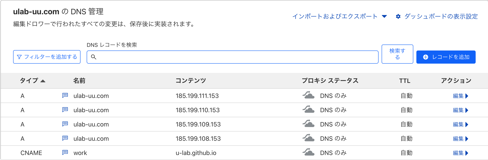

# U-lab lp

mainブランチにマージすると自動でデプロイされるようになっています。

レコードの構成
ref: https://docs.github.com/ja/pages/configuring-a-custom-domain-for-your-github-pages-site/managing-a-custom-domain-for-your-github-pages-site

CloudflareのHTTPSオプションを使わず、GitHub Pagesの`Enforce HTTPS`を使うようにするため、
Cloudflareダッシュボードから`SSL/TLS > エッジ証明書 > 常にHTTPSを使用`をオフにし、
各レコードのプロキシステータスのスイッチを`プロキシ済み`から`DNSのみ`に変更しました。

ref: https://www.noamlerner.com/post/setting_up_a_custom_domain/
